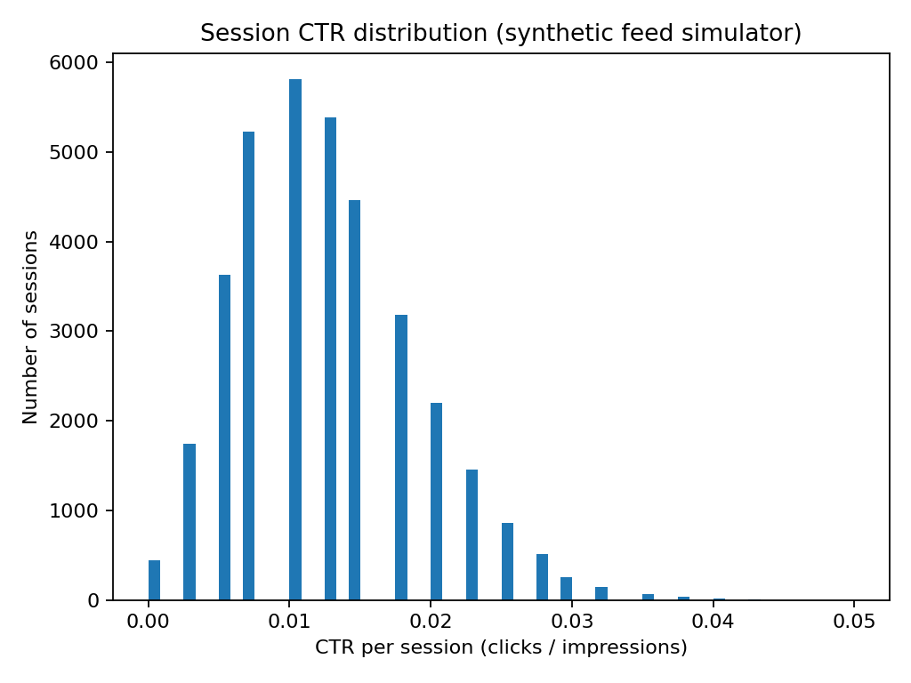
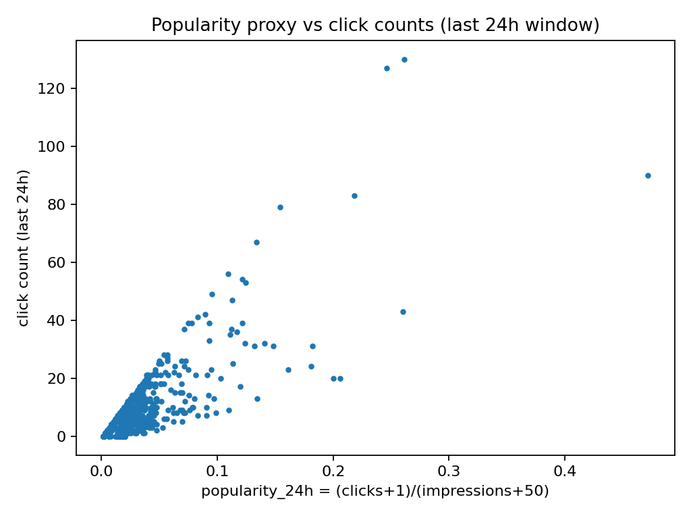
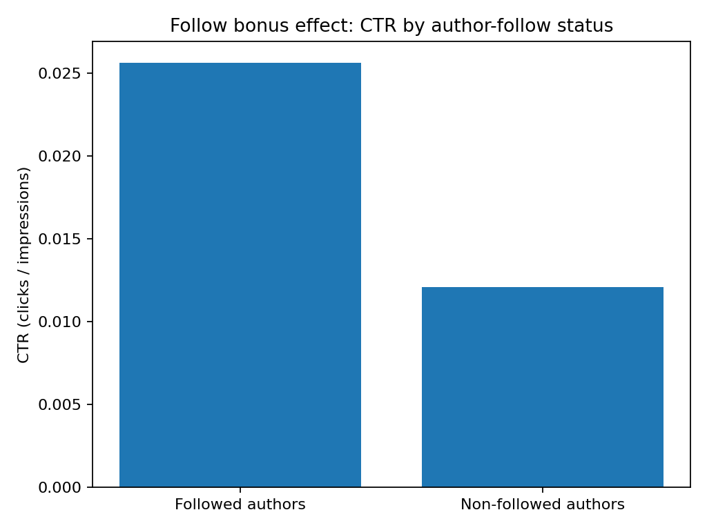

# Real-Time Personalized Feed Ranking Engine

**An End-to-End Machine Learning System (Retrieval → Ranking → Evaluation)**


## Overview

This project implements an **end-to-end personalized feed ranking engine** inspired by large-scale consumer platforms such as Meta, Twitter, and LinkedIn.

Rather than focusing on a single model, the project emphasizes the **full machine learning system lifecycle**:

* realistic data generation
* candidate retrieval vs ranking separation
* rigorous offline evaluation
* diagnostics and sanity checks
* business-aligned metrics

The goal is to demonstrate how ranking systems are **designed, validated, and iterated** in real-world production settings.


## Quickstart

```bash
pip install numpy pyyaml matplotlib
python -m scripts.run_diagnostics
python -m scripts.compare_retrievals_end_to_end
```

This runs the simulator, validates data realism, and compares retrieval strategies end-to-end.


## Business Impact Summary

Personalized feed ranking systems directly influence:

* **User engagement** (CTR, dwell time, session length)
* **Retention** (relevance reduces churn)
* **Content discovery and creator health**
* **Revenue** (ads, subscriptions, discovery efficiency)

This project shows how ML-driven ranking creates business value by improving **top-K relevance**, where most user attention is concentrated.

### Engagement Uplift Potential

* Baseline heuristics surface only **~5–6% of clicked items within the top-100**.
* Diagnostics reveal strong but underexploited signals (e.g., **~2× CTR uplift for followed authors**).
* Improved retrieval alone yields **~3× Recall@100**, demonstrating large headroom before retraining the ranker.

At scale, such improvements typically translate into **double-digit engagement gains**.


## Problem Setting

At each session:

* A user is shown **hundreds of candidate posts**
* Feedback is **implicit** (click / no-click)
* Engagement is **sparse and noisy**
* The system must return a ranked feed under latency constraints

This reflects real-world feed ranking challenges where:

* Individual signals are weak
* Learning requires aggregating many small effects
* Evaluation must be carefully designed to avoid leakage


## System Architecture (Current Scope)

```
Synthetic Event Generator
        ↓
Session Builder (Impressions + Clicks)
        ↓
Candidate Retrieval
        ↓
Ranking Function
        ↓
Offline Evaluation (NDCG, Recall, MAP)
        ↓
Diagnostics & Sanity Checks
```

Future iterations extend this pipeline with learned retrieval, learning-to-rank models, and real-time serving.


## Data Simulation

To enable controlled experimentation, the project uses a **synthetic but realistic feed simulator**.

### Entities

* **Users:** 2,000
* **Posts:** 5,000
* **Authors:** 800
* **Latent topics:** 20
* **Time span:** 14 days

### User Behavior Model

Each user has a latent topic-preference vector that:

* Evolves over time (taste drift)
* Interacts with post topics

### Click Probability Depends On

* Topic match (user ↔ post)
* Post freshness
* Post popularity
* Whether the user follows the post’s author

The simulator intentionally produces **sparse implicit feedback**, making ranking non-trivial.


## Baseline System

### Candidate Retrieval (Heuristic)

Top-K candidates are selected using:

* Popularity (smoothed CTR proxy)
* Recency
* Author-follow bonus

### Ranking

Candidates are ranked using a linear scoring function combining:

* Popularity
* Freshness
* Follow signal

This represents a **business-as-usual heuristic feed** and provides a lower bound.


## Baseline Results

Evaluated on ~50k sessions with time-based train/validation/test splits:

```
Validation:
  NDCG@10    ≈ 0.01–0.02
  Recall@100 ≈ 3–4%

Test:
  NDCG@10    ≈ 0.01
  Recall@100 ≈ 5–6%
```

### Interpretation

* Ranking is genuinely difficult due to large candidate sets and sparse clicks
* Heuristics capture limited personalization signal
* Significant headroom exists for learned retrieval and ranking


## Diagnostics & Data Validation

Before introducing learned models, the simulator and baseline are validated.

### Session-Level Engagement

From a representative local run:

* Mean session CTR ≈ **1.24%**
* Median session CTR ≈ **1.25%**
* 90th percentile CTR ≈ **2%**
* ~400 impressions per session with ~5 clicks on average

This confirms realistic sparsity and avoids trivial ranking scenarios.

### Popularity Signal

* Popularity correlates weakly-to-moderately with clicks
* Useful, but insufficient for strong personalization

### Follow Bonus Effect

CTR by author-follow status:

* **Followed authors:** ~2.6%
* **Non-followed authors:** ~1.2%
* **Uplift:** ~2.1×

This validates meaningful behavioral structure while preserving room for learning.

<p align="center">
  
  
  
</p>


## Week 2: Retrieval Improvement (Key Result)

We evaluate the impact of improved **candidate retrieval** while holding the **ranking function fixed**.
This isolates the effect of retrieval quality.

### Experimental Setup

* Ranking model: unchanged
* Features: unchanged
* Only candidate retrieval is modified
* Evaluation: time-based validation/test split

### Retrieval Strategies Compared

* **Baseline retrieval:** popularity + recency + follow
* **Topic-based retrieval:** candidates aligned with user’s recent topic preferences, with exploration

### End-to-End Results (Test Set)

| Metric     | Baseline Retrieval | Topic Retrieval | Lift            |
| ---------- | ------------------ | --------------- | --------------- |
| Recall@100 | 0.0569             | 0.1665          | **+192% (~3×)** |
| NDCG@100   | 0.0352             | 0.0868          | **+147%**       |
| MAP@100    | 0.0041             | 0.0105          | **+158%**       |

Top-10 metrics (e.g., NDCG@10) remain similar, as expected, since the ranker has not yet been retrained to exploit the expanded candidate set.

### Key Insight

> **Retrieval quality is the primary bottleneck.**
> Improving retrieval alone yields large gains in coverage and relevance before any ranking model changes.


## Ablations & Findings

* **Co-visitation retrieval underperformed** because simulator impression sets are unstructured (random exposure), yielding weak co-occurrence signal.
* **Topic-based retrieval succeeds** because it aligns with the simulator’s latent preference structure.
* This highlights a critical applied insight:
  **retrieval methods are highly dependent on the data-generating and exposure mechanisms.**


## Metrics Definitions

* **Recall@K:** Fraction of clicked items appearing in the top-K ranked list
* **NDCG@K:** Position-sensitive relevance metric (higher weight for top ranks)
* **MAP@K:** Mean average precision over ranked positions

These metrics are standard in large-scale ranking systems.


## Reproducibility

* All experiments are configured via `configs/dev.yaml`
* Fixed random seeds ensure reproducibility
* Time-based splits prevent information leakage
* Key reports are saved as JSON in `outputs/`


## Project Structure

```
feed-ranking-engine/
├── README.md
├── LICENSE
├── pyproject.toml
├── configs/
│   └── dev.yaml
├── src/
│   └── frec/
│       ├── data/
│       │   ├── schema.py
│       │   └── simulator.py
│       ├── retrieval/
│       │   ├── baseline.py
│       │   ├── covisit.py
│       │   └── topic.py
│       ├── eval/
│       │   └── ranking_metrics.py
│       └── viz/
│           └── diagnostics.py
├── scripts/
│   ├── run_baseline_eval.py
│   ├── run_diagnostics.py
│   ├── run_topic_retrieval_eval.py
│   ├── run_covisitation_eval.py
│   └── compare_retrievals_end_to_end.py
├── assets/
│   └── figures/
└── .gitignore
```


## Key Takeaways

* Feed ranking with implicit feedback is inherently difficult
* Heuristic systems leave substantial business value untapped
* Retrieval quality dominates early-stage performance
* Diagnostics are essential before model iteration

This establishes a strong, credible foundation for learned ranking systems.


## Roadmap (Next Steps)

1. Retrain ranker using topic-based retrieval candidates
2. Learning-to-rank (LambdaRank / neural rankers)
3. Two-tower embedding-based retrieval
4. Real-time feature updates
5. Latency optimization & monitoring
6. Offline-to-online evaluation alignment


## License

This project is released under the **MIT License**.
